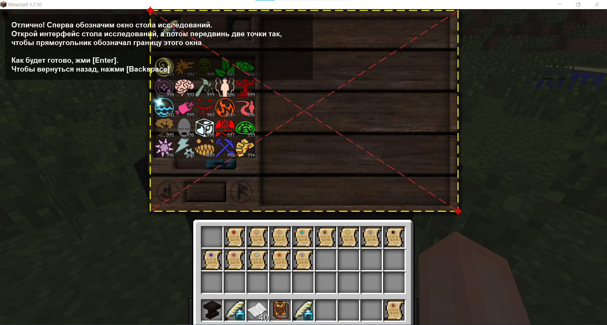
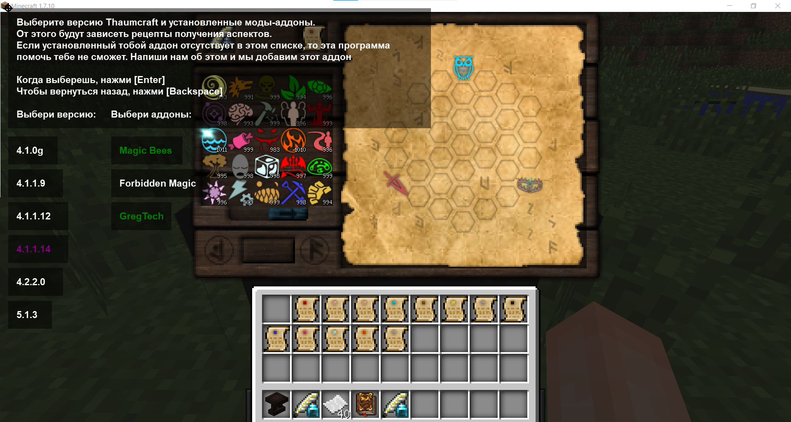
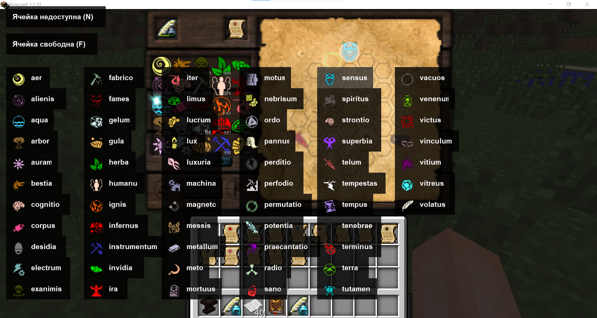

# Автоматический исследователь для мода Thaumcraft 4
> _**Thaumcraft**_ - мод для игры _Minecraft_, часто устанавливающийся в магические сборки модов на популярных серверах
> 
Программа **автоматически решает и раскладывает** записки исследований в столе исследований.
Весь интерфейс взаимодействия полупрозрачный и показывается поверх всех окон.

Программа **никак** не взаимодействует с кодом игры и не определяется античитами. 
Все что она делает - это смотрит на **пиксели на экране**, и имитирует **действия мышью и клавиатурой**, как если бы это делал человек.

---

## [Доступные релизы](https://github.com/SergTyapkin/thaumcraft-auto-researcher/releases)
[Последняя версия `v0.2.0-alpha`](https://github.com/SergTyapkin/thaumcraft-auto-researcher/releases/tag/v0.2.0-alpha)
<details>
<summary>Changelog:</summary>
<option>- Ускорено решение цепочек аспектов в ~8 раз</option>
<option>- Добавлено логирование в .log-файлы внутри исполняемого .exe</option>
</details>


По любым вопросам/предложеиям, пишите: [t.me/tyapkin_s](https://t.me/tyapkin_s)

## Порядок работы
### Первоначальная настройка
1. Демонстрация и проверка того, что точки с перекрестьями можно двигать. 
Просто передвиньте красную точку на желтую.

2. Необходимо указать программе, где находится интерфейс стола исследований. 
Для этого углы желтого прямоугольника необходимо передвинуть так, чтобы они шли по внешнему периметру стола, как показано на скриншоте ниже

3. Необходимо более детально дать знать программе, где внутри стола зачарований находятся кнопки взаимодействия.
Для этого передвиньте все точки, как показано на скриншоте ниже

4. Выберите версию вашего Thaumcraft и все установленные аддоны
 

После выполнения всех этих действий, все выборы пользователя сохраняюся,
при следующем запуске программы это делать не обязательно, будет показан сразу следующий шаг.
Вернуться к конфигурации всегда можно, нажав клавишу `Backspace`

### Решение цепочек аспектов
1. Записки исследований из левого верхнего слота инвентаря будут автоматически положены в стол исследований.
Кликните на существующий аспект на поле и выберите его из списка аспектов


2. Для всех остальных аспектов сделайте то же самое, а так же отметьте все ячейки, в которые
аспекты нельзя класть (пустые). Должно получиться аналогично скриншоту ниже:

3. Если цепочка аспектов слишком большая или в ней используются аспекты, которых у вас нет, нажмите `R`, чтобы перегенерировать её

4. Прежде чем начать, убедитесь, что в чернильнице достаточно чернил. Если они закончатся, алгоритм выкладывания аспектов будет прерван.
Затем нажмите `Enter`, и начнется процесс выкладывания аспектов на стол по полученным цепочкам.
5. После окончания выкладывания аспектов, записка исследований будет положена в инвентарь,
а вместо неё в стол положена следующая из инвентаря.
Процесс можно начинать заново. Таким образом можно решать большое количество записок, лежащих в инвентаре друг за другом


## В следующих версиях
- Автоопределение аспектов на столе с помощью нейросети.
- Автоопределение имеющихся аспектов в столе и их количества, выстраивание цепочек на основе этой информации.
- Редактирование исходных конфигов
- Проверка корректности определения исходных аспектов
- Проверка корректности выложенных цепочек
- Больше поддерживаемых версий и аддонов
- Отслеживание состояния чернильницы

---
## Запуск из исходников:
1. Установка зависимостей:
```shell
pip install -r requirements.txt
```

2. Запуск из корня проекта (требуется версия `Python 3.10` или выше):
```shell
python ./src/main.py
```
